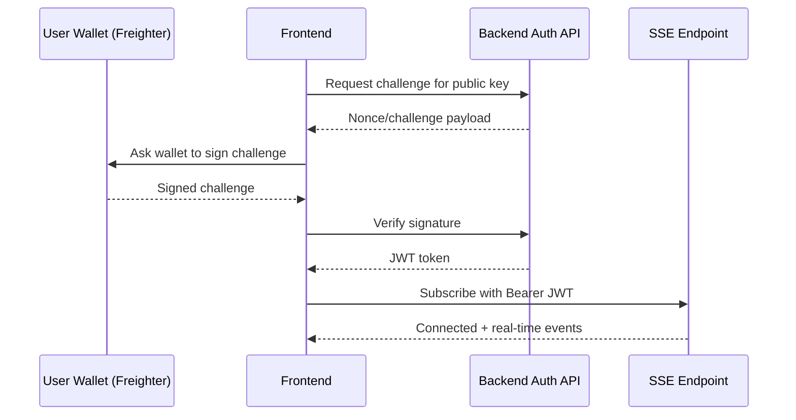

# FlowFi Architecture

This document explains how FlowFi moves data from on-chain contract events into API responses and real-time frontend updates.

# FlowFi Architecture

This document explains how FlowFi moves data from on-chain contract events into API responses and real-time frontend updates.

## High-Level Overview

```mermaid
flowchart LR
    Contract[Stream Contract (Soroban WASM)] --> Indexer[Soroban Event Indexer]
    Indexer --> DB[(Postgres DB)]
    DB --> API[Backend API (Express + SSE)]
    API --> UI[Frontend (Next.js)]
    UI --> API

```mermaid
flowchart LR
    C["Soroban Stream Contract\nEvent Emission"] --> W["Event Worker / Indexer\nbackend/src/workers"]
    W --> P["Prisma ORM"]
    P --> D[("PostgreSQL")]
    D --> API["Express API\nREST + SSE"]
    API --> SSE["SSE Service\nConnection Registry"]
    SSE --> FE["Next.js Frontend\nDashboard + Profile"]

    API <--> R[("Redis Pub/Sub\nMulti-instance fanout")]
    R <--> SSE
```

## Core Components

1. Soroban contract: source of truth for stream state and events.
1. Event worker/indexer: reads events from Stellar/Soroban, normalizes payloads, and persists stream state + stream events.
1. PostgreSQL + Prisma: query layer for fast read APIs.
1. Express API: serves versioned REST endpoints and long-lived SSE subscriptions.
1. Frontend: consumes REST for initial state and SSE for real-time deltas.

## Event Type Data Flows

### 1) CREATED

1. Contract emits `CREATED`.
1. Worker inserts `Stream` row with sender, recipient, token, amount/rate/timestamps.
1. Worker inserts `StreamEvent` row.
1. SSE broadcasts `stream.created` to stream and user channels.
1. Frontend refreshes outgoing/incoming lists and summary cards.

### 2) TOPPED_UP

1. Contract emits `TOPPED_UP` with top-up amount.
1. Worker updates `Stream.depositedAmount` and `lastUpdateTime`.
1. Worker inserts `StreamEvent`.
1. SSE broadcasts `stream.topped_up`.
1. Frontend updates TVL/deposit values.

### 3) WITHDRAWN

1. Contract emits `WITHDRAWN` with claimed amount.
1. Worker updates `Stream.withdrawnAmount` and `lastUpdateTime`.
1. Worker inserts `StreamEvent`.
1. SSE broadcasts `stream.withdrawn`.
1. Frontend updates balances and claimable indicators.

### 4) CANCELLED

1. Contract emits `CANCELLED`.
1. Worker marks `Stream.isActive = false` and updates `lastUpdateTime`.
1. Worker inserts `StreamEvent`.
1. SSE broadcasts `stream.cancelled`.
1. Frontend moves stream to historical state.

### 5) COMPLETED

1. Contract emits `COMPLETED` (fully drained lifecycle).
1. Worker marks `Stream.isActive = false`.
1. Worker inserts `StreamEvent`.
1. SSE broadcasts `stream.completed`.
1. Frontend marks stream complete.

### 6) PAUSED / RESUMED

FlowFi timing math supports pause windows by excluding paused wall-clock duration from effective streaming time.

Paused behavior:

1. On `PAUSED`, worker stores pause start metadata and stream remains non-progressing.
1. On `RESUMED`, worker computes paused interval duration and accumulates `totalPausedSeconds`.
1. Claimable calculations use effective elapsed time:

$$
\text{effectiveElapsed} = \max(0,\, now - lastUpdateTime - totalPausedSecondsSinceLastUpdate)
$$

$$
\text{streamed} = \text{effectiveElapsed} \times \text{ratePerSecond}
$$

$$
\text{claimable} = \min(\text{streamed},\, depositedAmount - withdrawnAmount)
$$

This prevents paused periods from increasing claimable balance.

## Pause/Resume Timing Model

Rules used by backend/domain logic:

1. Time is tracked in Unix seconds.
1. Claimable only advances while stream is active and not paused.
1. Multiple pause/resume intervals are cumulative.
1. Resume re-baselines time accounting so no double counting occurs.
1. Cancellation/completion finalizes stream and halts further accrual.

## Authentication Flow



## SSE in Single vs Multi-Instance Mode

Single instance:

1. API writes SSE event directly to in-memory client registry.

Multi-instance (recommended for horizontal scale):

1. Instance A receives event and publishes to Redis channels (`sse:stream:*`, `sse:user:*`).
1. All API instances subscribe to matching channels.
1. Each instance rebroadcasts to its own connected clients.

Benefits:

1. Real-time fanout works across replicas.
1. Sticky sessions are not required for event delivery.
1. API replicas can scale independently while preserving SSE correctness.

## Operational Notes

1. `/v1/events/stats` exposes active SSE connections and connection-capacity metrics.
1. Admin metrics include SSE peak-per-IP visibility for abuse monitoring.
1. User summary endpoint (`/v1/users/{address}/summary`) is cached for 30s to protect DB hot paths.
