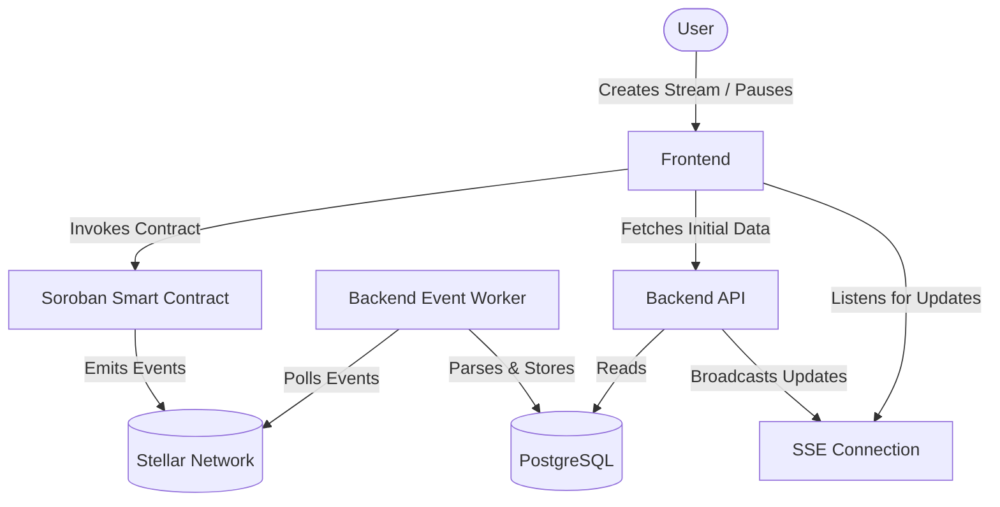

# FlowFi Architecture Overview

This document provides a high-level overview of how FlowFi's components interact and how the system processes on-chain events.

## System Components & Architecture

FlowFi consists of three main components:

1. **Soroban Smart Contracts** - On-chain logic for payment streams
2. **Backend API** - Indexing, API endpoints, and real-time event streaming
3. **Frontend** - User interface built with Next.js



## Data Flow by Event Type

When a user interacts with the contract, it emits specific events that the backend indexer picks up:

- **`stream_created`**: The indexer creates a new stream record in the DB, setting the total duration, per-second rate, and initial balances.
- **`stream_topped_up`**: The indexer increases the deposited amount in the stream record and updates the projected end time based on the rate.
- **`stream_paused`**: The indexer marks the stream as `isPaused = true`, recording the timestamp of the pause. Claimable balance calculations temporarily stop.
- **`stream_resumed`**: The indexer marks the stream as `isPaused = false` and calculates the total duration the stream was paused to correctly offset future accrual.
- **`stream_cancelled`**: The indexer sets `isActive = false`. Funds are permanently divided between sender and recipient as of the cancellation block.
- **`tokens_withdrawn`**: The indexer updates the withdrawn amount and adjusts remaining balances.
- **`stream_completed`**: The indexer marks the stream as finished after all funds have been withdrawn.

## Pause/Resume Timing Model

To accurately track how much has accrued in a stream, we must exclude the time the stream spent in a paused state.

When a stream is **paused**, we record `last_paused_at`.
When a stream is **resumed**, we calculate the difference `current_time - last_paused_at` and add this duration to a running `total_paused_seconds` tally.

**Accrual Formula:**
```
accrued_time = current_time - start_time - total_paused_seconds
claimable_balance = accrued_time * rate_per_second
```
This model ensures that the recipient does not earn funds while the stream is paused, and no complex iterative calculations are required on-chain or off-chain.

## Database Schema Overview

The backend uses PostgreSQL with the following primary entities:

- **`Stream`**: The core entity tracking streams. Fields include `contract_id`, `sender`, `recipient`, `rate_per_second`, `total_paused_seconds`, `is_paused`, and `is_active`.
- **`StreamEvent`**: An append-only log of all events processed by the indexer. Used for historical reconstruction and providing activity feeds.
- **`User`**: Tracks Stellar wallet addresses.
- **`indexer_state`**: A single-row table tracking the last successfully processed ledger, ensuring the indexer can resume correctly after a restart.

## Component Interactions

### 1. Soroban Smart Contracts
**Location:** `contracts/stream_contract/`
The smart contract handles all on-chain logic for payment streams.

### 2. Backend API
**Location:** `backend/`
The backend provides REST endpoints for querying data and SSE endpoints for real-time updates.

### 3. Frontend
**Location:** `frontend/`
The Next.js application that displays streams and integrates with Stellar wallets.

## Related Documentation

- [Development Guide](DEVELOPMENT.md) - Local setup and workflow
- [SSE Architecture](../backend/docs/SSE_ARCHITECTURE.md) - Detailed SSE implementation
- [Contributing Guide](../CONTRIBUTING.md) - Development setup and workflows
